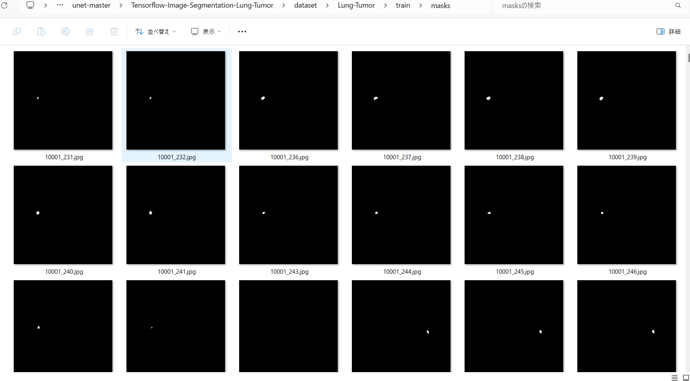

<h2>Tensorflow-Image-Segmentation-Lung-Tumor (2024/05/04)</h2>

This is an experimental Image Segmentation project for Lung-Tumor based on
the <a href="https://github.com/sarah-antillia/Tensorflow-Image-Segmentation-API">Tensorflow-Image-Segmentation-API</a>, and
<a href="https://drive.google.com/file/d/1oNdi1K1Nq-uK52NY-03HuCtG_VTT4TR-/view?usp=sharing">Lung-Tumor-ImageMask-Dataset-V1.zip</a>.
 

 
 
Actual Image Segmentation Sample for a lung image. 
<table>
<tr>
<th>Input: image</th>
<th>Mask (ground_truth)</th>
<th>Prediction: inferred_mask_merged</th>
</tr>
<tr>
<td></td>
<td></td>
<td></td>
</tr>
</table>

 
In this experiment, we have used the simple UNet Model 
<a href="./src/TensorflowUNet.py">TensorflowSlightlyFlexibleUNet</a> for this Lung-Tumor Segmentation. 
As shown in <a href="https://github.com/sarah-antillia/Tensorflow-Image-Segmentation-API">Tensorflow-Image-Segmentation-API</a>.
you may try other Tensorflow UNet Models: 

<li><a href="./src/TensorflowSwinUNet.py">TensorflowSwinUNet.py</a></li>
<li><a href="./src/TensorflowMultiResUNet.py">TensorflowMultiResUNet.py</a></li>
<li><a href="./src/TensorflowAttentionUNet.py">TensorflowAttentionUNet.py</a></li>
<li><a href="./src/TensorflowEfficientUNet.py">TensorflowEfficientUNet.py</a></li>
<li><a href="./src/TensorflowUNet3Plus.py">TensorflowUNet3Plus.py</a></li>
<li><a href="./src/TensorflowDeepLabV3Plus.py">TensorflowDeepLabV3Plus.py</a></li>

 

<h3>1. Dataset Citation</h3>
The dataset used here has been taken from the following <a href="http://medicaldecathlon.com/">
Medical Segmentation Decathlon 
Generalisable 3D Semantic Segmentation
</a>. 
<pre>
All data will be made available online with a permissive copyright-license (CC-BY-SA 4.0), 
allowing for data to be shared, distributed and improved upon. 
All data has been labeled and verified by an expert human rater, and with the best effort 
to mimic the accuracy required for clinical use. 
To cite this data, please refer to https://arxiv.org/abs/1902.09063
</pre>

 

<h3>
<a id="2">
2. Lung-Tumor ImageMask Dataset
</a>
</h3>
 If you would like to train this Lung-Tumor Segmentation model by yourself,
 please download the latest normalized dataset from the google drive 
<a href="https://drive.google.com/file/d/1cOSiTXeU_l8duN_DNTyPFnfeZEuMKodn/view?usp=sharing">
Lung-Tumor-ImageMask-Dataset-V1.zip</a>. 

 
Please expand the downloaded ImageMaskDataset and place them under <b>./dataset</b> folder to be
<pre>
./dataset
└─Lung-Tumor
    ├─test
    │   ├─images
    │   └─masks
    ├─train
    │   ├─images
    │   └─masks
    └─valid
        ├─images
        └─masks
</pre>

<b>Lung-Tumor Dataset Statistics</b> 
 
 

 
<b>Train_images_sample</b> 

 
<b>Train_masks_sample</b> 

 

<h3>
4 Train TensorflowUNet Model
</h3>
 We have trained Lung-Tumor TensorflowUNet Model by using the following
<a href="./projects/TensorflowSlightlyFlexibleUNet/Lung-Tumor/train_eval_infer.config"> <b>train_eval_infer.config</b></a> file.  
Please move to ./projects/Lung-Tumor and run the following bat file. 
<pre>
>1.train.bat
</pre>
, which simply runs the following command. 
<pre>
>python ../../../src/TensorflowUNetTrainer.py ./train_eval_infer.config
</pre>
<pre>
; train_eval_infer.config
; 2024/05/04 (C) antillia.com

[model]
model         = "TensorflowUNet"
generator     = False
image_width    = 512
image_height   = 512
image_channels = 3
input_normalize = False
num_classes    = 1
base_filters   = 16
base_kernels   = (5,5)
num_layers     = 7
dropout_rate   = 0.08
learning_rate  = 0.0001
clipvalue      = 0.5
dilation       = (2,2)
loss           = "bce_dice_loss"
metrics        = ["binary_accuracy"]
show_summary   = False

[train]
epochs        = 100
batch_size    = 4
patience      = 10
metrics       = ["binary_accuracy", "val_binary_accuracy"]
model_dir     = "./models"
eval_dir      = "./eval"
image_datapath = "../../../dataset/Lung-Tumor/train/images/"
mask_datapath  = "../../../dataset/Lung-Tumor/train/masks/"
create_backup  = False
learning_rate_reducer = True
reducer_patience      = 5
save_weights_only = True

[eval]
image_datapath = "../../../dataset/Lung-Tumor/valid/images/"
mask_datapath  = "../../../dataset/Lung-Tumor/valid/masks/"

[test] 
image_datapath = "../../../dataset/Lung-Tumor/test/images/"
mask_datapath  = "../../../dataset/Lung-Tumor/test/masks/"

[infer] 
images_dir    = "./mini_test/images"
output_dir    = "./mini_test_output"
merged_dir   = "./mini_test_output_merged"

[segmentation]
colorize      = True
black         = "black"
white         = "green"
blursize      = None

[mask]
blur      = False
blur_size = (3,3)
</pre>

The training process has just been stopped at epoch 83.  
 
 
 
<a href="./projects/TensorflowSlightlyFlexibleUNet/Lung-Tumor/eval/train_metrics.csv">train_metrics.csv</a> 
 

 
<a href="./projects/TensorflowSlightlyFlexibleUNet/Lung-Tumor/eval/train_losses.csv">train_losses.csv</a> 
 

 

<h3>
5 Evaluation
</h3>
Please move to a <b>./projects/TensorflowSlightlyFlexibleUNet/Lung-Tumor</b> folder, 
and run the following bat file to evaluate TensorflowUNet model for Lung-Tumor. 
<pre>
./2.evaluate.bat
</pre>
<pre>
python ../../../src/TensorflowUNetEvaluator.py ./train_eval_infer_aug.config
</pre>
Evaluation console output: 

  
<a href="./projects/TensorflowSlightlyFlexibleUNet/Lung-Tumor/evaluation.csv">evaluation.csv</a> 
The loss (bce_dice_loss) score for this test dataset is low as shown below. 
<pre>
loss,0.117
binary_accuracy,0.9982
</pre>

<h3>
6 Inference
</h3>
Please move to a <b>./projects/TensorflowSlightlyFlexibleUNet/Lung-Tumor</b> folder 
,and run the following bat file to infer segmentation regions for images by the Trained-TensorflowUNet model for Lung-Tumor. 
<pre>
./3.infer.bat
</pre>
<pre>
python ../../../src/TensorflowUNetInferencer.py ./train_eval_infer_aug.config
</pre>
 

mini_test_images 
 
mini_test_mask(ground_truth) 
 
 

Inferred test masks 
 
 

Inferred test masks_merged 
 
 

<b>Enlarged image and masks</b> 

<table>
<tr>
<th>Image</th>
<th>GroundTruth</th>

<th>Inferred-mask</th>
<th>Inferred-mask-merged</th>
</tr>

<tr>
<td></td>
<td></td>
<td></td>
<td></td>
</tr>

<tr>
<td></td>
<td></td>
<td></td>
<td></td>
</tr>

<tr>
<td></td>
<td></td>
<td></td>
<td></td>
</tr>
<tr>
<td></td>
<td></td>
<td></td>
<td></td>
</tr>

</table>
 
 

<h3>
References
</h3>
<b>1. Lung Tumor Image Segmentation from Computer Tomography Images Using MobileNetV2 and Transfer Learning</b> 
<pre>
Bioengineering (Basel). 2023 Aug; 10(8): 981.
Published online 2023 Aug 20. doi: 10.3390/bioengineering10080981
</pre>
Zainab Riaz, Bangul Khan, Saad Abdullah, Samiullah Khan, and Md Shohidul Islam1 
<pre>
https://www.ncbi.nlm.nih.gov/pmc/articles/PMC10451633/
</pre>

<b>2. Medical Segmentation Decathlon: Generalisable 3D Semantic Segmentation</b> 
<pre>
http://medicaldecathlon.com/
</pre>

<b>3. ImageMask-Dataset-Lung-Tumor</b> 
Toshiyuki Arai antillia.com
<pre>
https://github.com/sarah-antillia/ImageMask-Dataset-Lung-Tumor
</pre>

